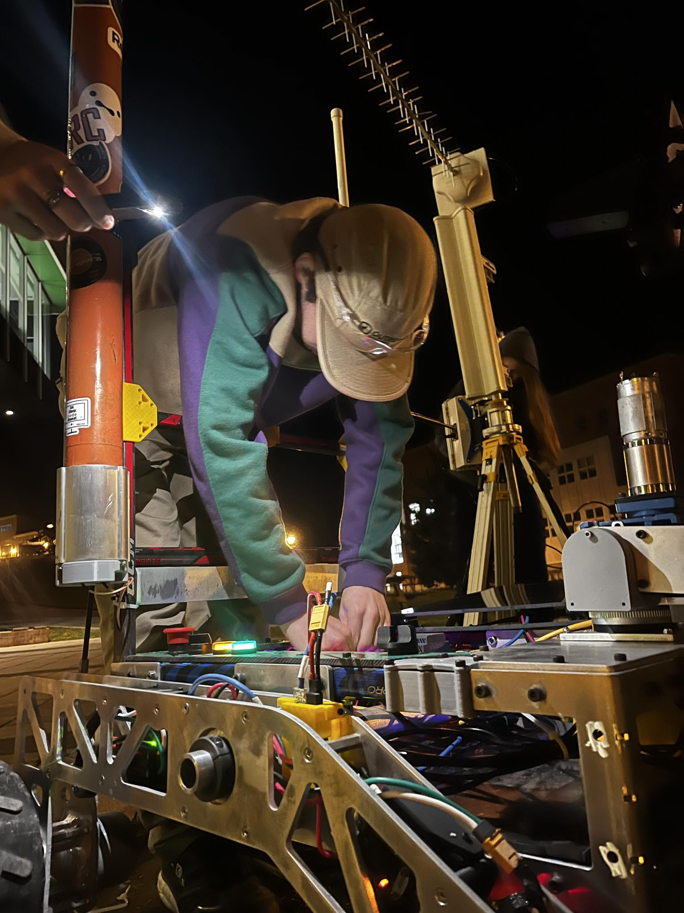
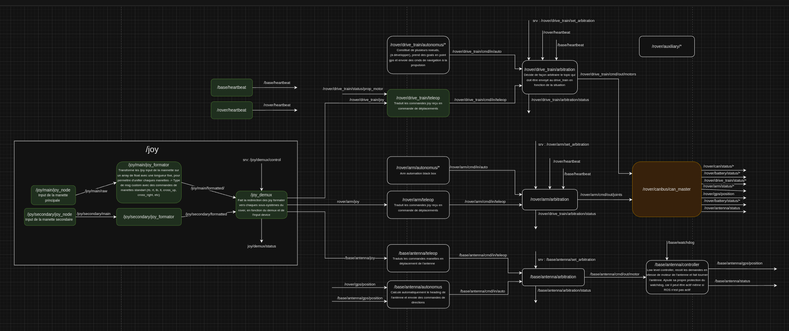
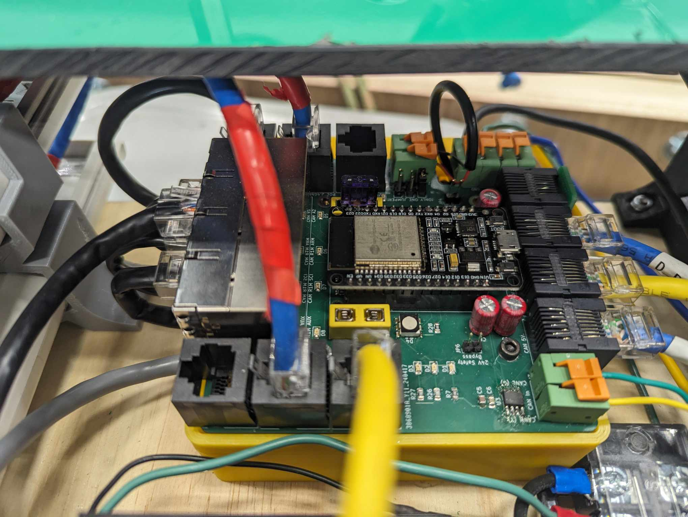
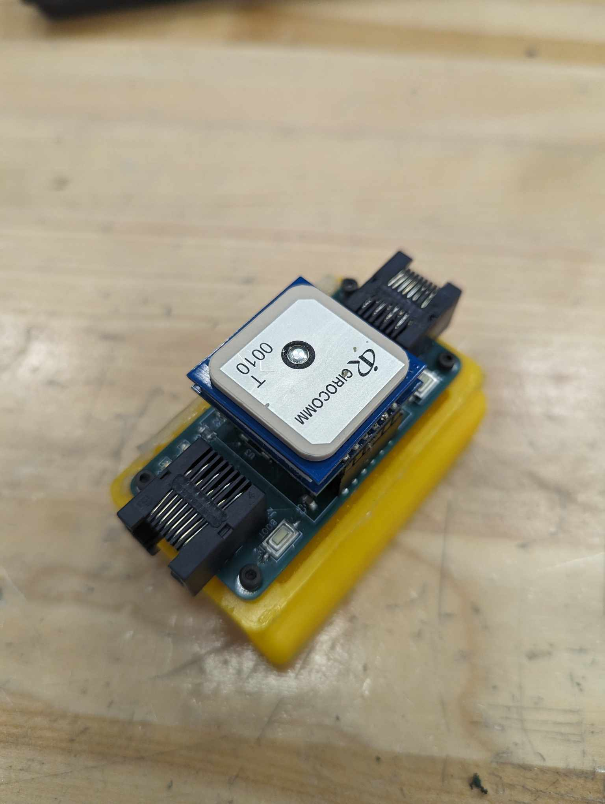

# Pour me joindre

- <micp1402@usherbrooke.ca>
- (418) 803-0546
- [linkedin](https://www.linkedin.com/in/pmichaud29/)
- [github](https://github.com/Pmichaud29)

## Bienvenue

Bienvenue dans mon portfolio. Plus bas, vous retrouverez quelques-uns de mes travaux de conception en robotique. Chaque projet démontre mes compétences techniques et mon engagement dans ce domaine passionnant. Bonne visite !

- [Pour me joindre](#pour-me-joindre)
  - [Bienvenue](#bienvenue)
  - [Robotique UdeS - Rovus](#robotique-udes---rovus)
    - [Réalisations 2023](#réalisations-2023)
    - [Réalisations 2024](#réalisations-2024)
      - [Programmation](#programmation)
      - [PCB](#pcb)
    - [Résultats](#résultats)
  - [Jeux de génie - La Machine](#jeux-de-génie---la-machine)
    - [C'est quoi La Machine ?](#cest-quoi-la-machine-)
    - [Mon rôle dans l'équipe de Sherbrooke 2024](#mon-rôle-dans-léquipe-de-sherbrooke-2024)
    - [Résultat](#résultat)
  - [Compétition Canadienne et Québécoise d'ingénierie - Conception senior](#compétition-canadienne-et-québécoise-dingénierie---conception-senior)
    - [C'est quoi l'épreuve de conception senior?](#cest-quoi-lépreuve-de-conception-senior)
    - [Mon rôle](#mon-rôle)
    - [Résultats CQI/CEC](#résultats-cqicec)

## Robotique UdeS - Rovus

Depuis 2022, je suis membre du groupe technique Robotique UdeS où nous concevons un rover martien pour la compétition [CIRC](https://circ.cstag.ca/2024/) en Alberta.

    
    <video width="400" height="400" controls muted>
        <source src="media/premier_test_propulsion.mp4" type="video/mp4">
    </video>

### Réalisations 2023

Pour l'édition 2023, j'étais responsable du contrôle. Voici quelques tâches que j'ai effectuées :

- Création du modèle cinématique du bras et implémentation d'un contrôle en cinématique différentielle inverse permettant de contrôler l'effecteur en cartésien (x, y, z, &alpha;).
- Code low-level pour les actuateurs du bras.
- Code high-level pour le contrôle de la propulsion.
- Intégration de caméras :
  - Détection automatique de marqueurs Aruco.
  - Algorithmes de compression pour limiter la bande passante.
- Développement de l'interface utilisateur de contrôle dans PyQt.
- Intégration du module GPS.

### Réalisations 2024

Pour l'édition 2024, je suis maintenant co-directeur du projet avec [Alexandre Baril](https://4lexandrb.github.io/index.html). Voici quelques réalisations dont je suis fier:

#### Programmation

- Développement de l'architecture de contrôle haut-niveau ROS2 :

- Développement d'un protocole de communication CanBus ainsi que d'une librairie multiplateforme (Linux et ESP32) permettant la création de messages personnalisés et offrant une interface simple pour les membres de l'équipe tout en utilisant une communication fiable entre les microcontrôleurs et l'ordinateur de bord du rover. [Si vous êtes curieux, voici le code source.](https://github.com/robotique-udes/rover_micro/tree/release/circ2024/lib/rover_can_lib/include)

<video width="400" height="400" controls muted> <source src="media/rover_can_lib_new_msg_example.webm" type="video/webm"> Your browser does not support videos. </video>

<!--  -->

#### PCB

- Drive de moteur DC pour les actuateurs du bras
  - 30V
  - ~30A continue
  - Communication CanBus
  - ESP32-S3 avec connecteur usb micro pour simplifier la programmation
  - Deux entrées d'encodeurs pour permettre un contrôle bas niveau limitant le backlash des joints du bras robotique.
  - Deux boutons de jog manuel pour les joints autoblocant et pour la calibration de l'encodeur absolue.

    
    
    

  ---

- Data distribution board:
  - Communication CanBus
  - Injecteurs POE 12V pour caméras IP.
  - Injecteurs POE 24V pour les modems 900MHz et 2.4GHz.
  - Plusieurs sorties 5V et CanBus pour les autres PCB.
  - Protection contre les surtensions et les sous-tensions pour le 5V, 12V et le 24V.
  - Interrupteur low side pour les lumières du rover et le klaxon.
  - Interrupteur high side pour l'injecteur 12V des caméras IP pour permettre un meilleur contrôle de la bande passante.
  - et autres.

    
    

- Developpement Board ESP32 CanBus pour le GPS ainsi et pour le magnétomètre du rover.

    
    
    
    

### Résultats

- CIRC2023, 5e place internationale, 2e place canadienne
- CRQRC2024, 1ère place

## Jeux de génie - La Machine

### C'est quoi La Machine ?

"[La] Machine est un défi parmi les plus difficiles à relever lors des Jeux de Génie. Le but : fabriquer une machine robotique intelligente qui surmontera les diverses épreuves d’un parcours prédéterminé en un temps donné. Durant les quatre mois précédant l’évènement, les équipes devront y mettre temps, ingéniosité et créativité afin de respecter les attentes des juges tout en respectant les devis. Les personnes participantes devront mettre à profit leurs connaissances acquises en ingénierie en plus d’administrer un budget consacré à l’achat des ressources afin de concrétiser leurs idées devant public et médias." -<https://jeuxdegenie.qc.ca/competitions/>

### Mon rôle dans l'équipe de Sherbrooke 2024

Responsable de la programmation, j'ai implémenté la majorité des fonctionnalités des deux robots, ceci comprend entre autres :

- L'intégration du PCB Teensy 4.1
- Le système de navigation autonome
  - Dead reckoning à l'aide de microswitches et de capteurs optiques de souris pour obtenir une odométrie précise même avec des roues omnidirectionnelles.
- Communication Wi-Fi entre les deux robots ESP32
- Le système de propulsion
- Le contrôle du bras
- Le système de crémaillères
- Le système d'aspiration
- et autres.

    <video width="300" height="400" controls muted> <source src="media/jdg_video1.mp4" type="video/mp4"> Your browser does not support videos. </video>
    <video width="400" height="400" controls muted> <source src="media/jdg_video_scene.m4v" type="video/mp4"> Your browser does not support videos. </video>

### Résultat

- 1ère place

## Compétition Canadienne et Québécoise d'ingénierie - Conception senior

### C'est quoi l'épreuve de conception senior?

"La conception senior constitue la pierre angulaire de la Compétition québécoise d’ingénierie. Les équipes de quatre personnes inscrites dans cette catégorie ont douze heures pour fabriquer un prototype qui saura répondre à la problématique qui leur est présentée le jour de la compétition. Au terme de ce marathon, les équipes démontrent la pertinence de leur solution en complétant, devant public, la tâche demandée à l’aide de leur prototype." - <https://cqi-qec.qc.ca/competitions>

### Mon rôle

Encore responsable de la programmation, ces compétitions sont un sprint d'intégration de capteurs et d'actuateurs assez simples. Il s'agit donc de tirer le meilleur du matériel et de se donner le meilleur contrôle possible avec notre modeste interface graphique.

<video height="200" controls muted> <source src="media/430841381_7246077925460069_4552138759987374999_n.mp4" type="video/mp4"> Your browser does not support videos. </video>
<video height="200" controls muted> <source src="media/430877584_25156527453961318_5479021671167666160_n.mp4" type="video/mp4"> Your browser does not support videos. </video>

<video width="200" controls muted> <source src="media/430870198_7222277981188438_4202924515055319083_n.mp4" type="video/mp4"> Your browser does not support videos. </video>

### Résultats CQI/CEC

- 1ère place à la Compétition québécoise d'ingénierie
- 1ère place à la Compétition canadienne d'ingénierie
