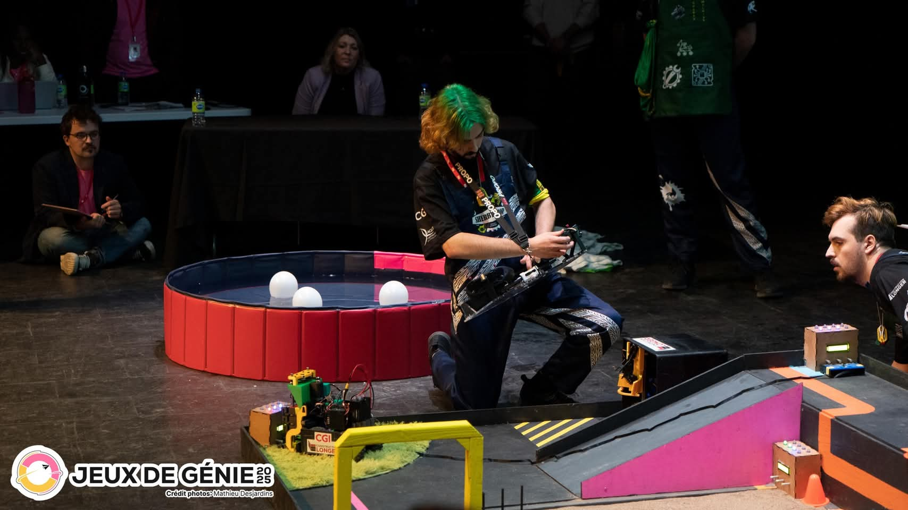
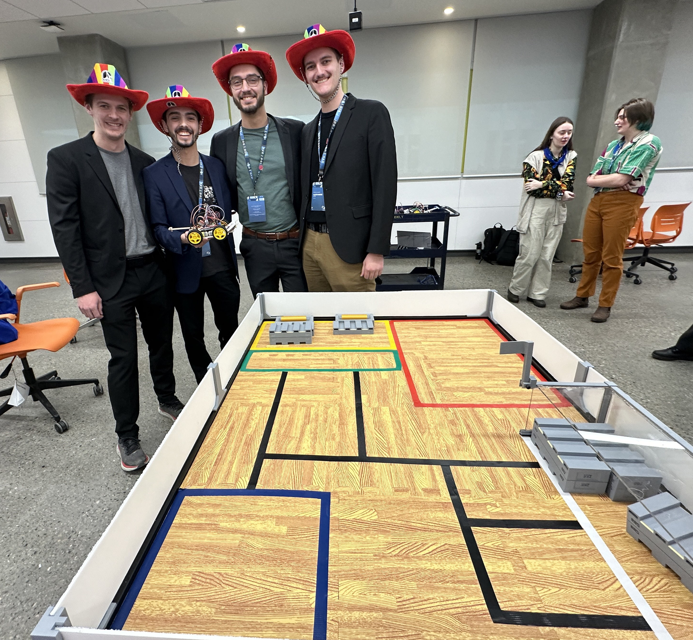
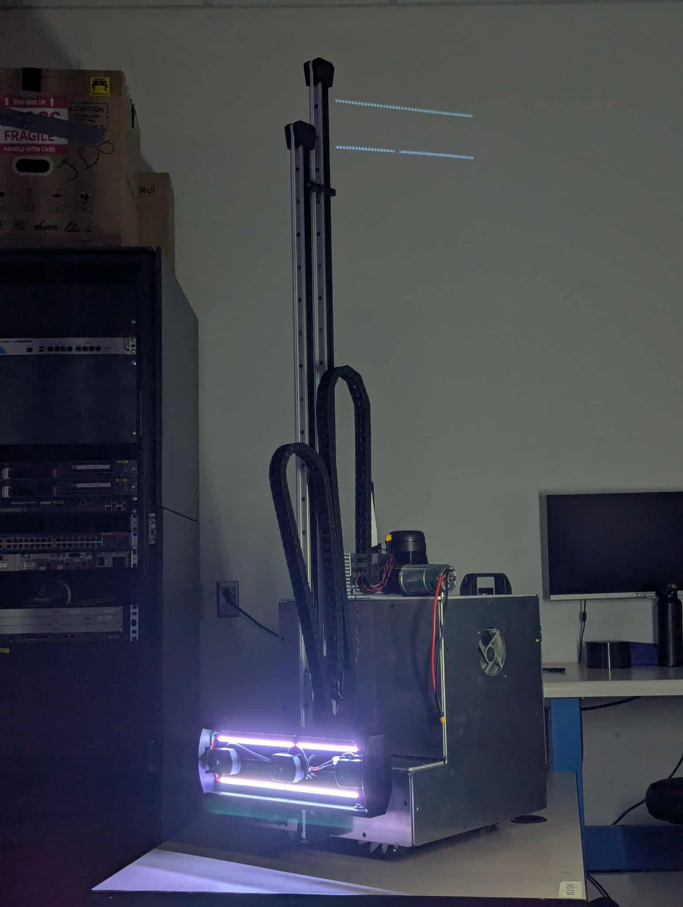

# Philippe Michaud

- <micp1402@usherbrooke.ca>
- (418) 803-0546
- [linkedin](https://www.linkedin.com/in/pmichaud29/)
- [github](https://github.com/Pmichaud29)

## Bienvenue

Bienvenue dans mon portfolio ! Vous découvrirez ci-dessous quelques-uns de mes projets de conception en robotique. Ils ont été réalisés en grande partie en équipe, mais les éléments présentés mettent en lumière mes contributions personnelles. Bonne visite!

## Projets et compétitions

- [Groupe technique Rovus – Robotique UdeS](robotique-udes/robotique-udes)
- [Jeux de génie – La Machine](machine/machine)
- [Compétition canadienne et québécoise d’ingénierie – Épreuve de conception sénior](cqi-cci/cqi-cci)
- [Projet majeur de conception - ROSIE](pmc/pmc)

### [Groupe technique Rovus – Robotique UdeS](robotique-udes/robotique-udes)

  

--------------------------------------------------------------------------------

### [Jeux de génie – La Machine](machine/machine)

  

--------------------------------------------------------------------------------

### [Compétition canadienne et québécoise d’ingénierie – Épreuve de conception sénior](cqi-cci/cqi-cci)

  

--------------------------------------------------------------------------------

### [Projet majeur de conception - ROSIE](pmc/pmc)

  

