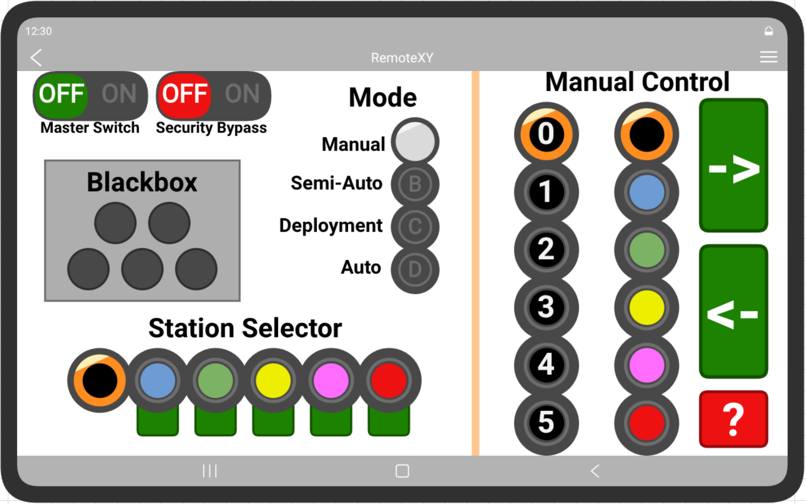
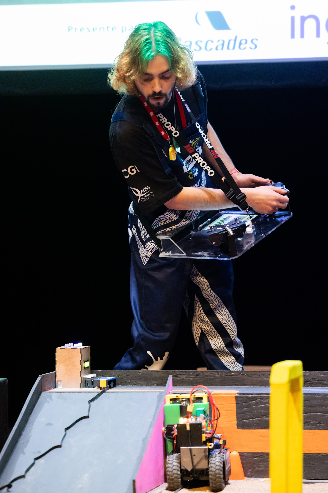
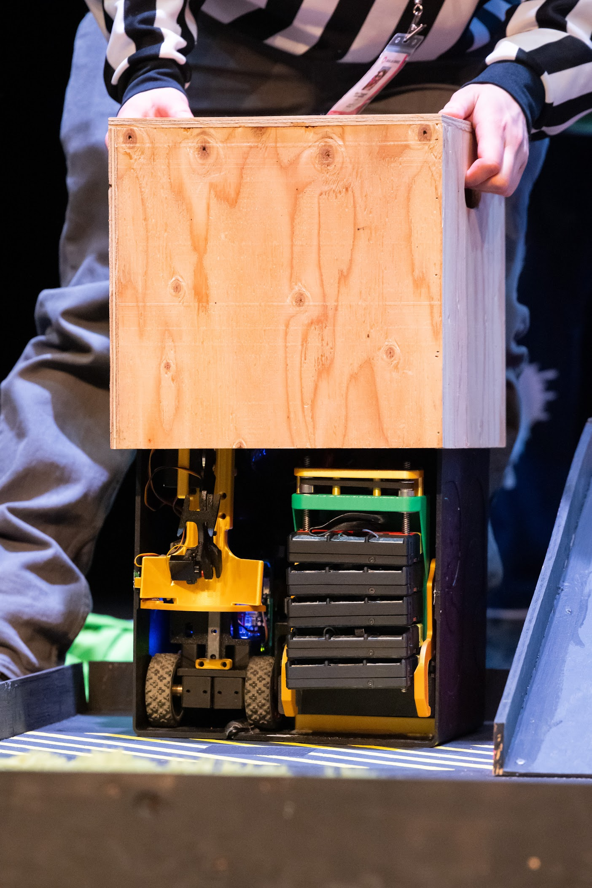

[↩ Retour à l’accueil](/index.html)

--------------------------------------------------------------------------------

# Jeux de génie - La Machine

## C'est quoi La Machine ?

"[La] Machine est un défi parmi les plus difficiles à relever lors des Jeux de Génie. Le but : fabriquer une machine robotique intelligente qui surmontera les diverses épreuves d'un parcours prédéterminé en un temps donné. Durant les quatre mois précédant l'évènement, les équipes devront y mettre temps, ingéniosité et créativité afin de respecter les attentes des juges tout en respectant les devis. Les personnes participantes devront mettre à profit leurs connaissances acquises en ingénierie en plus d'administrer un budget consacré à l'achat des ressources afin de concrétiser leurs idées devant public et médias." -<https://jeuxdegenie.qc.ca/competitions/>

## Résultat

- 🥇 1ère place 2024
- 🥇 1ère place 2025

## Mon rôle dans l'équipe de Sherbrooke 2024

Responsable de la programmation, j'ai implémenté la majorité des fonctionnalités des deux robots, ceci comprend entre autres :

- L'intégration du PCB Teensy 4.1
- Le système de navigation autonome
  - Dead reckoning à l'aide de microswitches et de capteurs optiques de souris pour obtenir une odométrie précise même avec des roues omnidirectionnelles.
- La communication Wi-Fi entre les deux robots
- Le système de propulsion
- Le contrôle du bras
- Le système de crémaillères
- Le système d'aspiration
- etc.

<video height="400" controls="" muted=""><source src="media/jdg_video1.mp4" type="video/mp4"> Your browser does not support videos. </video>
<video height="400" controls="" muted=""><source src="media/jdg_video_scene.m4v" type="video/mp4"> Your browser does not support videos. </video>

## Mon rôle dans l'équipe de Sherbrooke 2025

Pilote et responsable de la programmation, j'ai implémenté tous les fonctionnalitées logicielles des deux robots ainsi que les "mini stations".

Notre solution robotique consistait en 2 robot: un pour ramasser les cônes et un pour déployer les 5 minis stations

Mes tâches ont consisté à implémenter le contrôles des deux robots Teensy 4.1 ainsi que d'adapter la *code base* Teensy sur ESP32 pour les mini-stations. Le plus gros du travail à été d'optimiser la logique de transfère de passagés (led) manuelle, semi-automatique et automatique ainsi que l'interface de contrôle qui était hébergé sur une des mini-stations.

Voici la vidéo de présentation:

    <video controls src="media/MachineUdeS2025-pertinant.mp4" title="Vidéo machine 2025" style="width: 800px">
    </video>

  

--------------------------------------------------------------------------------

[↩ Retour à l’accueil](/index.html)
