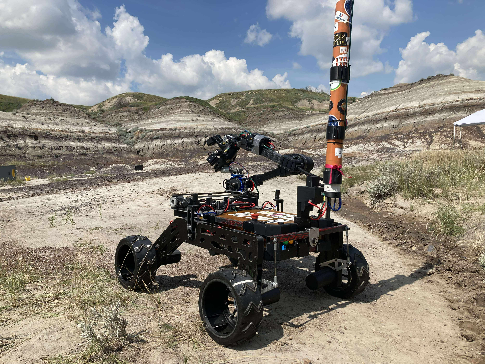
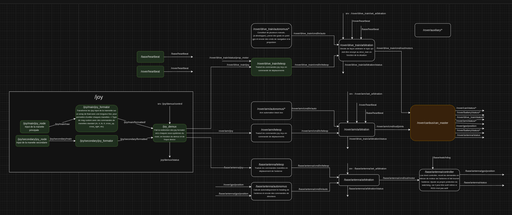
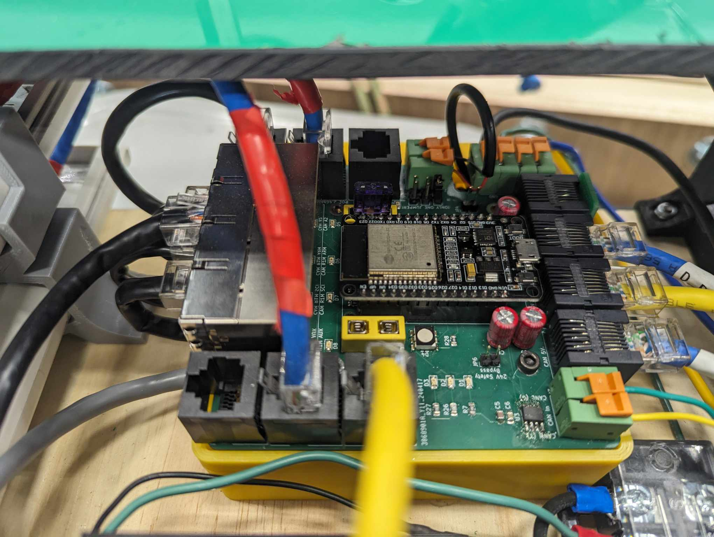
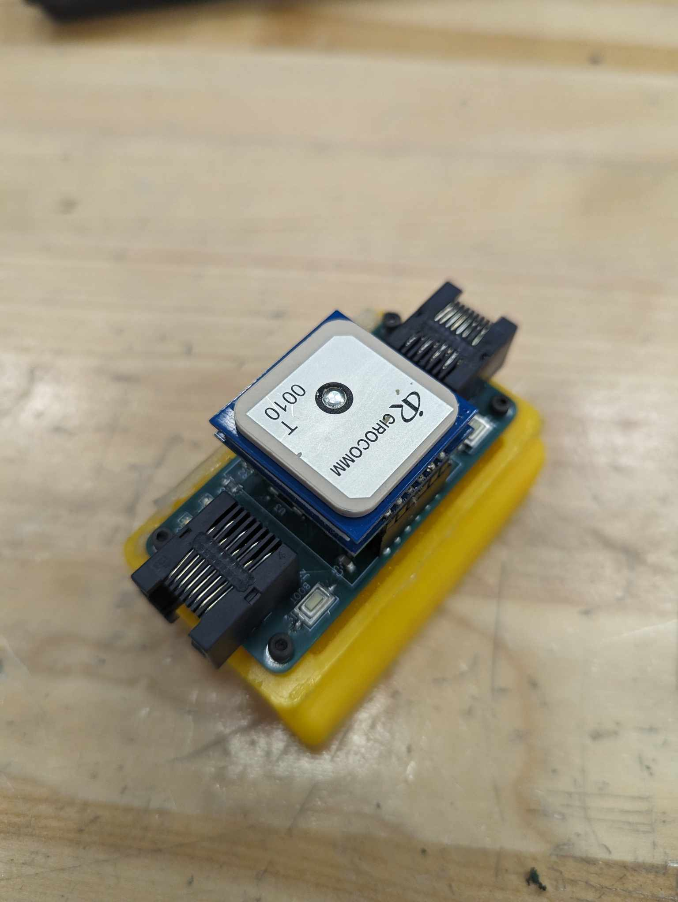

[<-- Retour à l’accueil](/index.md)

--------------------------------------------------------------------------------

# Robotique UdeS - Rovus

Depuis 2022, je fais partie du groupe technique Rovus dans Robotique UdeS, où nous concevons un rover martien destiné à la compétition [*CIRC*](https://circ.cstag.ca/2024/) en Alberta. Je m’y implique depuis maintenant trois ans, dont les deux dernières à titre de co-directeur du projet ainsi que responsable de l’électronique et de la programmation.

  

  

</video>

## Résultats

- CIRC2025: À voir!
- CIRC2024: 5e place internationale, 2e place canadienne
- CRQRC2024: 1ère place
- CIRC2023: 5e place internationale, 2e place canadienne

-Photo Compé-

## Réalisations 2023

Pour l'édition 2023, j'étais responsable du contrôle. Voici quelques tâches que j'ai effectuées :

- Création du modèle cinématique du bras et implémentation d'un contrôle en cinématique différentielle inverse permettant de contrôler l'effecteur en cartésien (x, y, z, α).
- Code low-level pour les actuateurs du bras.
- Code high-level pour le contrôle de la propulsion.
- Intégration de caméras :

  - Détection automatique de marqueurs Aruco.
  - Algorithmes de compression pour limiter la bande passante.

- Développement de l'interface utilisateur de contrôle dans PyQt.

- Intégration du module GPS.

## Réalisations 2024

Pour l'édition 2024, je suis maintenant co-directeur du projet avec [Alexandre Baril](https://4lexandrb.github.io/index.html). Voici quelques réalisations dont je suis fier:

### Programmation

- Développement de l'architecture de contrôle haut-niveau ROS2 : 

- Développement d'un protocole de communication CanBus ainsi que d'une librairie multiplateforme (Linux et ESP32) permettant la création de messages personnalisés et offrant une interface simple pour les membres de l'équipe tout en utilisant une communication fiable entre les microcontrôleurs et l'ordinateur de bord du rover. [Si vous êtes curieux, voici le code source.](https://github.com/robotique-udes/rover_micro/tree/release/circ2024/lib/rover_can_lib/include)

  <video width="1200" controls="" muted=""><source src="media/rover_can_lib_new_msg_example.webm" type="video/webm"> Your browser does not support videos. </video>

 

<!--  -->

 ### PCB

- Drive de moteur DC pour les actuateurs du bras

  - 30V
  - ~30A continue
  - Communication CanBus
  - ESP32-S3 avec connecteur usb micro pour simplifier la programmation
  - Deux entrées d'encodeurs pour permettre un contrôle bas niveau limitant le backlash des joints du bras robotique.
  - Deux boutons de jog manuel pour les joints autoblocant et pour la calibration de l'encodeur absolue.

    
    

--------------------------------------------------------------------------------

- Data distribution board:

  - Communication CanBus
  - Injecteurs POE 12V pour caméras IP.
  - Injecteurs POE 24V pour les modems 900MHz et 2.4GHz.
  - Plusieurs sorties 5V et CanBus pour les autres PCB.
  - Protection contre les surtensions et les sous-tensions pour le 5V, 12V et le 24V.
  - Interrupteur low side pour les lumières du rover et le klaxon.
  - Interrupteur high side pour l'injecteur 12V des caméras IP pour permettre un meilleur contrôle de la bande passante.
  - et autres.

    

- Developpement Board ESP32 CanBus pour le GPS ainsi et pour le magnétomètre du rover.

    
    
    

### Réalisations 2025

L'objectif de l'année 2025 était d'améliorer la fiabilité et d'optimiser les systèmes déjà existants pour mieux performer. Mes implications les plus marquants sont les suivante;

#### Programmation (voir codebase [microcontroller](https://github.com/robotique-udes/rover_micro) et [ROS](https://github.com/robotique-udes/rover))

- Réécriture de la librairie CanBus de 2024 en CRTP en respectant des meilleurs pratiques de programmation pour augmenter la vitesse d'execution -> Temps de traitement réduit d'environ 200 000 fois (benchmark approximatif).
- Écriture d'un HAL sur mesure pour le projet optimisé pour ESP32-S3 en C++, utilisant du "compile time polymorphism" à l'aide des "concepts" introduits en C++20.
- Écriture d'une librairie globale commune entre tous les projets C++ sur linux pour augmenter l'uniformité de chaque module et promouvoir une gestion de mémoire (RAII) plus sécuritire.
- Implémentation de pipeline CI/CD ainsi que de tests automatisés
- Overhaul de l'interface utilisateur en Qt6

-Photo Avant/Après + Photos avec tous les PCBs-

### PCB

- Overhaul complet de la boite électrique pour réduire son emprunte et son poid, prend maintenant 2x moins d'espace et est 4 fois plus léger.

-Photo Avant/Après + Photos avec tous les PCBs-

--------------------------------------------------------------------------------

[<-- Retour à l’accueil](/index.md)
