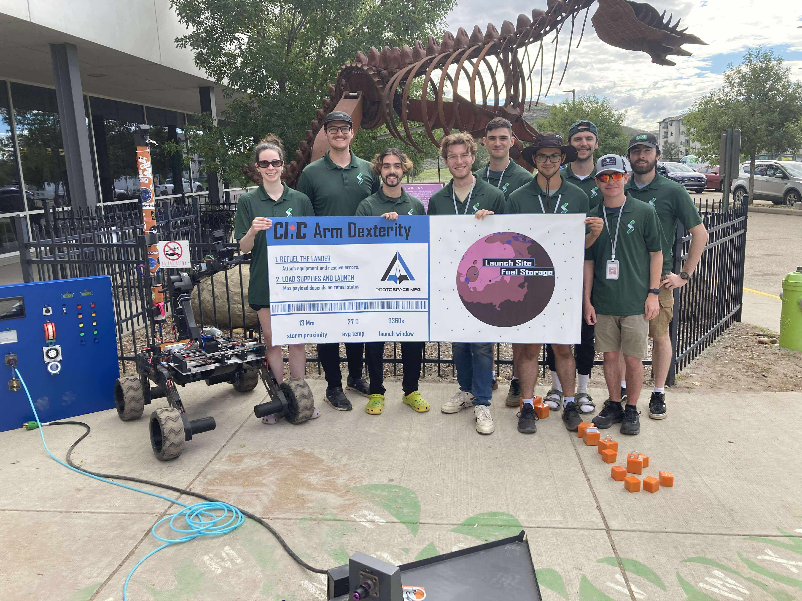

[< Retour à l’accueil](/index.html)

--------------------------------------------------------------------------------

# Robotique UdeS – Rovus

Depuis 2022, je fais partie du groupe technique Rovus au sein de Robotique UdeS, où nous concevons un rover martien destiné à la compétition [*CIRC*](https://circ.cstag.ca/2024/) en Alberta.  
Je m’y implique depuis maintenant trois ans, dont les deux dernières à titre de co-directeur du projet ainsi que responsable de l’électronique et de la programmation.

  
  

## Résultats

- CIRC 2025 : 336 points → 5e place internationale, 2e place canadienne  
- CIRC 2024 : 147 points → 5e place internationale, 2e place canadienne  
- CRQRC 2024 : 1re place  
- CIRC 2023 : 154 points → 5e place internationale, 2e place canadienne

  

## Réalisations 2023

Pour l’édition 2023, j’étais responsable du contrôle. Voici quelques tâches que j’ai effectuées :

- Création du modèle cinématique du bras et implémentation d’un contrôle en cinématique différentielle inverse permettant de contrôler l’effecteur en cartésien (x, y, z, α).
- Code bas-niveau (microcontrôleur) pour les actionneurs du bras.
- Code haut-niveau (ROS) pour le contrôle de la propulsion.
- Intégration de caméras :
  - Détection automatique de marqueurs ArUco.
  - Intégration d’algorithmes de compression pour limiter la bande passante.
- Développement de l’interface utilisateur de contrôle sous PyQt.
- Intégration du module GPS.

## Réalisations 2024

Pour l’édition 2024, je suis devenu co-directeur du projet. Voici quelques réalisations dont je suis particulièrement fier :

### Programmation

- Développement de l’architecture de contrôle haut-niveau sous ROS2.  
- Conception d’un protocole de communication CanBus et d’une librairie multiplateforme (Linux et ESP32) permettant la création de messages personnalisés et offrant une interface simple et fiable entre les microcontrôleurs et l’ordinateur de bord du rover.

### PCB

- Drive de moteur DC pour les actionneurs du bras :
  - 30 V  
  - ~30 A continu  
  - Communication CanBus  
  - ESP32-S3 avec connecteur micro-USB pour simplifier la programmation  
  - Deux entrées d’encodeurs pour un contrôle bas-niveau limitant le jeu mécanique des joints  
  - Deux boutons de jog manuel pour les joints autobloquants et la calibration de l’encodeur absolu

  
  
  

---

- Data distribution board :
  - Communication CanBus  
  - Injecteurs PoE 12 V pour caméras IP  
  - Injecteurs PoE 24 V pour modems 900 MHz et 2.4 GHz  
  - Multiples sorties 5 V et CanBus pour les autres PCB  
  - Protection contre les surtensions et sous-tensions
  - Low side switch pour les lumières et le klaxon  
  - High side switch pour l’injecteur 12 V des caméras IP afin de mieux gérer la bande passante

  
  

- Devboard ESP32 CanBus pour le GPS et le magnétomètre du rover.

  
  

## Réalisations 2025

L’objectif de l’année 2025 était d’améliorer la fiabilité et d’optimiser les systèmes existants pour de meilleures performances. Voici mes principales contributions :

### Programmation  
(voir code source [microcontrôleur](https://github.com/robotique-udes/rover_micro) et [ROS](https://github.com/robotique-udes/rover))

- Réécriture de la librairie CanBus 2024 en CRTP selon de meilleures pratiques, augmentant considérablement la vitesse d’exécution → traitement environ 200 000 fois plus rapide (benchmark approximatif).  
- Développement d’un HAL sur mesure en C++ optimisé pour ESP32-S3, utilisant du polymorphisme au temps de compilation grâce aux *concepts* de C++20.  
- Création d’une librairie commune C++ entre les projets Linux pour uniformiser les modules et renforcer la sécurité mémoire (RAII).  
- Mise en place d’un pipeline CI/CD et de tests automatisés.  
- Refonte complète de l’interface utilisateur en Qt6.

  <video height="400" controls muted>
    <source src="media/arm-test-circ2025.mp4" type="video/mp4">
    Your browser does not support the video tag.
  </video>

  <video height="400" controls muted>
    <source src="media/rover-driving-circ2025.mp4" type="video/mp4">
    Your browser does not support the video tag.
  </video>

### PCB

- Refonte complète de la boîte électrique pour réduire son encombrement et son poids : deux fois moins d’espace occupé et quatre fois plus légère.

## Galerie
--------------------------------------------------------------------------------

--------------------------------------------------------------------------------

[< Retour à l’accueil](/index.html)
